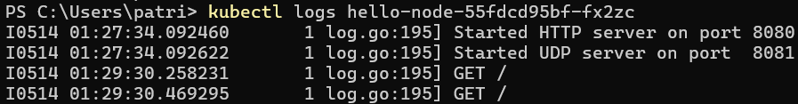

##  Reflection on Hello Minikube
1. Compare the application logs before and after you exposed it as a Service. Try to open the app several times while the proxy into the Service is running. What do you see in the logs? Does the number of logs increase each time you open the app? 
Ya, log mengalami penambahan setiap kalo kita membuka aplikasi. Hal ini terjadi karena logs akan bertambah setiap kali kita melakukan request GET. Berikut adalah perbedaan antara logs sebelum dan sesudah aplikasi di-expose sebagai sebuah service. 
Sebelum:

Sesudah:

2.  Notice that there are two versions of `kubectl get` invocation during this tutorial section.
The first does not have any option, while the latter has `-n` option with value set to `kube-system`. What is the purpose of the `-n` option and why did the output not list the pods/services that you explicitly created?
Fungsi opsi `-n` pada `kubectl get` adalah untuk mendefinisikan namespace yang resourcenya ingin kita lihat. Jadi, `kubectl get` tanpa `-n` hanya akan menunjukkan menampilkan informasi secara default, yaitu resource pada tempat kita bekerja sekarang. Di sisi lain, `kubectl get` dengan `-n` akan menampilkan deskripsi resource yang terkhusus pada namespace yang diinginkan saja.